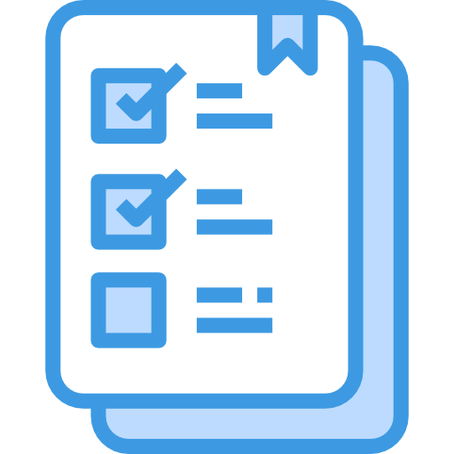

<a name="readme-top" id="readme-top"></a>

<!-- PROJECT ICON -->
<br />
<div align="center">
  <p>
    
  </p>

  <h2 align="center"><b>GOODTASK</b></h2>

  <p align="center">
  A modern and simple API to serve a to-do list application 
    <br />
    <br />
    <a href="https://github.com/chalestristian/goodtask-service/tree/main/src"><strong>Explore the source code</strong></a>
    <!--<br />-->
    <!--<a href="#">View Demo</a>-->
    <br />
    <br />
    Welcome to <b>goodtask-service</b>!
    <a href="https://github.com/chalestristian/goodtask-frontend"><u><strong>&#10096; check goodtask-frontend &#10097;</strong></u></a>
    <br />
    <br />
  </p>
</div>

<!-- TABLE OF CONTENTS -->
<details>
  <summary><b>SUMMARY</b></summary>
  <ol>
    <li>
      <a href="#about-the-project">About The Project</a>
      <ul>
        <li><a href="#built-with">Built With</a></li>
      </ul>
    </li>
    <li>
      <a href="#getting-started">Getting Started</a>
      <ul>
        <li><a href="#prerequisites">Prerequisites</a></li>
        <li><a href="#installation">Installation</a></li>
      </ul>
    </li>
    <li><a href="#usage">Usage</a></li>
  </ol>
</details>

<br />

<!-- ABOUT THE PROJECT -->
## About The Project

<br />

![Product Name Screen Shot][product-screenshot]

<br />

This project was initially created by me in 2021 while I was taking the _programming of computational solutions_ class. When I did this project, the solution worked, but it didn't look good. I had no much idea about software architecture and that's the main reason why I decided to redo it.

My professor gave me an A for the project. He knows we didn't have the solution architecture class before yours, so he just wanted to see it work and it worked well.

Now, more experienced, I decided to refactor this project to make it as simple and easy as possible, using concise patterns and updating the tools used.

This project is about the service only. If you want to see the frontend, can go to: [chalestristian/goodtask-frontend](https://github.com/chalestristian/goodtask-frontend)

<br />

### Built With

Major frameworks/libraries used to bootstrap this project:

* ![Node][Node]
* ![Express][Express]
* ![Typescript][Typescript]
* ![Postgres][Postgres]

<br />

<p align="right"><a href="#readme-top"><b>[BACK TO TOP] &#8593;</b></a></p>

<!-- GETTING STARTED -->
## Getting Started

This is an example of how you may setting up this project locally.
To get a local copy up and running, follow these simple example steps.

<br />

### Prerequisites

You need to have npm and git installed to continue.
* npm
  ```sh
  npm install npm@latest -g
  ```
 * git: <u>[git-scm.com](https://git-scm.com/)</u>
  

<br />

### Installation

1. Clone the repo:
   ```sh
   git clone https://github.com/chalestristian/goodtask-service.git
   ```
2. Go to the main directory:
   ```sh
   cd goodtask-service/src
   ```
3. Install npm packages
   ```sh
   npm install
   ```
4. You will need to create a database table to storage the data. For this, you can use the script model below on your favorite database tool, I suggest DBeaver:
   ```sql
   CREATE TABLE public.tasks (
	  id serial4 NOT NULL,
	  task varchar NOT NULL,
	  active bool NOT NULL,
	  created timestamptz NOT NULL DEFAULT CURRENT_TIMESTAMP,
	  updated timestamptz NOT NULL DEFAULT CURRENT_TIMESTAMP,
	  CONSTRAINT tasks_pkey PRIMARY KEY (id)
    );
   ```
5. Now, on the <b>/src</b> folder, create a .env file following the model:
   ```sh
   DB_HOST= your-dbhost-here
   DB_PORT= your-dbport-here
   DB_USERNAME= your-dbusername-here
   DB_PASSWORD= your-dbpassword-here
   DB_DATABASE= your-database-here
   ```

6. Now, you just have to compile and run the project with the following commands:
   ```sh
   npm run build
   ```
   ```sh
   npm start
   ```

<br />

<p align="right"><a href="#readme-top"><b>[BACK TO TOP] &#8593;</b></a></p>

<!-- USAGE EXAMPLES -->
## Usage

Once you have set the project up, you are able to use the API.
By default, as you can see on <i>src/Server.ts</i>, the app will listen the 3000 port.

You can use a postman collection on <i>/postman</i> directory to try the CRUD.
Just open postman and then: <i>menu > file > import</i> (or <b>CTRL + O</b>)

<p align="right"><a href="#readme-top"><b>[BACK TO TOP] &#8593;</b></a></p>


<br><br>
<div>
<a href="https://www.linkedin.com/in/chalestristian/"></a>
<a href="mailto:thales.cristianeugenio@gmail.com?subject=Contact From Github"></a>
</div>

<!-- MARKDOWN LINKS & IMAGES -->

[product-screenshot]: images/screenshot.png
[Node]: https://img.shields.io/badge/node-000000?style=for-the-badge&logo=nodedotjs&logoColor=green
[Express]: https://img.shields.io/badge/express-000000?style=for-the-badge&logo=express&logoColor=white
[Typescript]: https://img.shields.io/badge/typescript-000000?style=for-the-badge&logo=typescript&logoColor=blue
[Postgres]: https://img.shields.io/badge/postgresql-000000?style=for-the-badge&logo=postgresql&logoColor=blue